## Hi, I'm Yvictor

Principal Software Engineer & Architect, building high-performance financial trading systems.

### Current Focus

- [polars_backtest_extension](https://github.com/Yvictor/polars_backtest_extension) - blazingly fast portfolio backtesting for Polars

### Work

- [Shioaji](https://sinotrade.github.io/) - Sinopac cross-platform trading API (sole architect)

### Tools I've Built

- TradingGym - trading & backtesting environment for RL agents
- polars_ta_extension - Ta-Lib for Polars expressions
- polars_pbv - price by volume extension for Polars
- binary_mirror - derive macro for parsing fixed-length binary data

**Tech:** Rust | C++ | Python | TypeScript

### Socials

- yvictor3141@gmail.com
- https://www.linkedin.com/in/yvictor/
- https://www.threads.com/@yv.ictor

---

